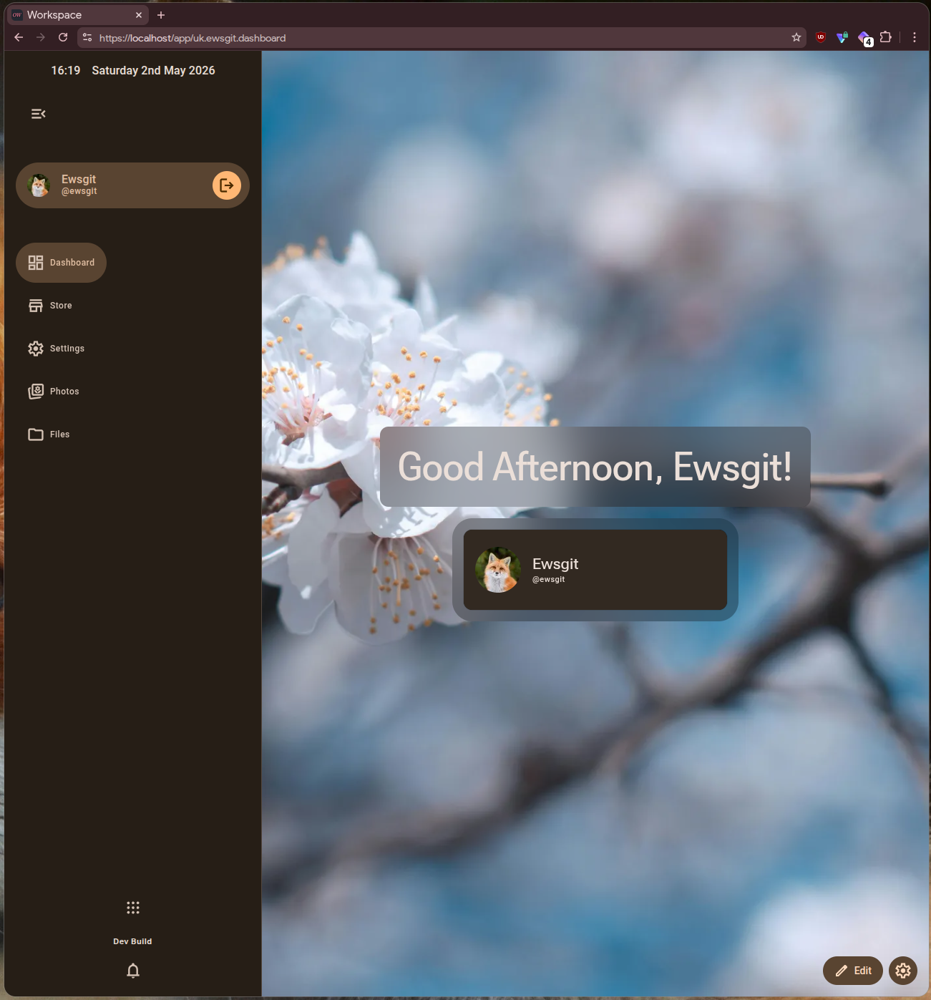
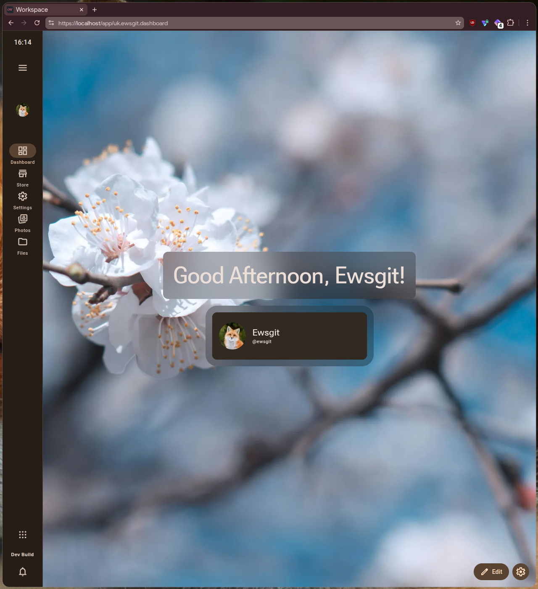
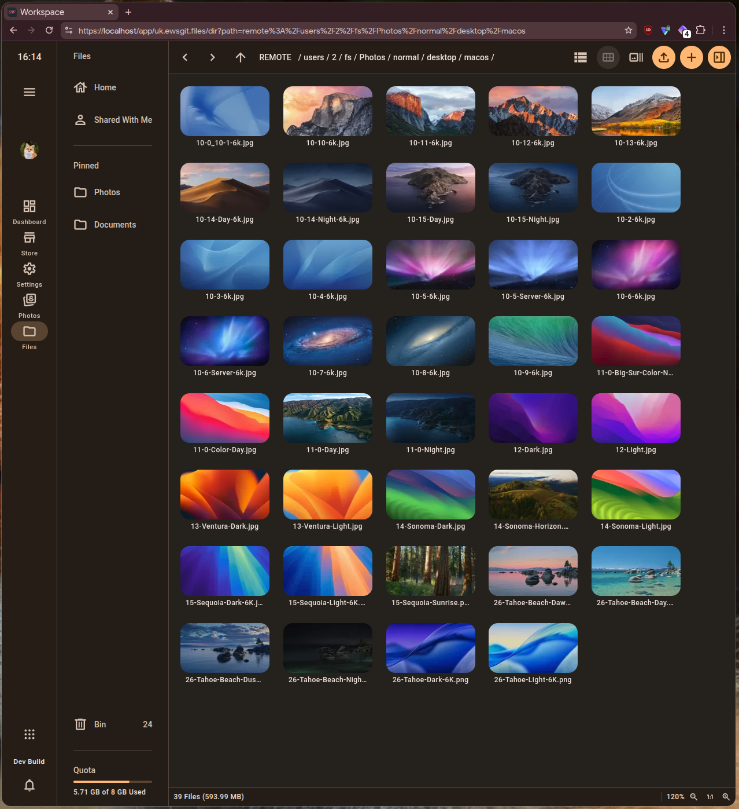
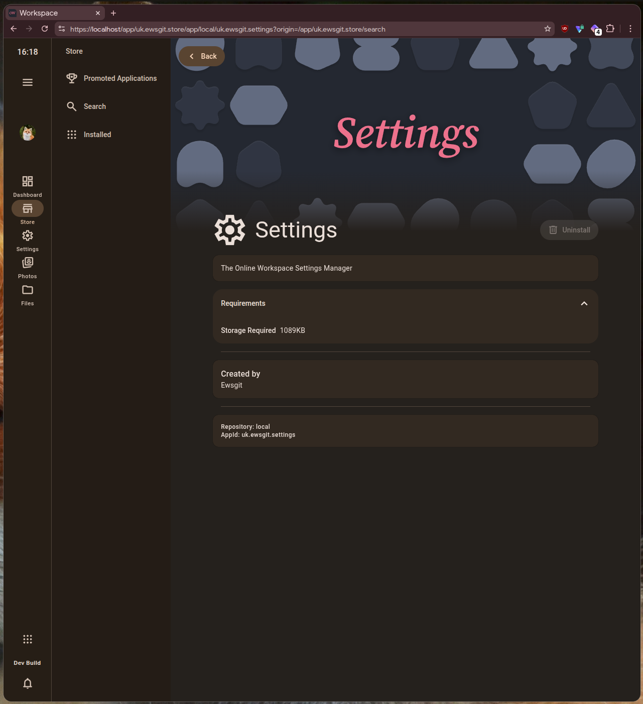
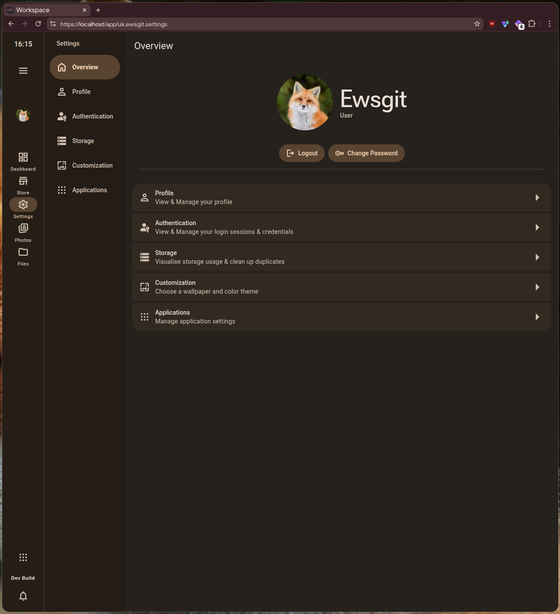
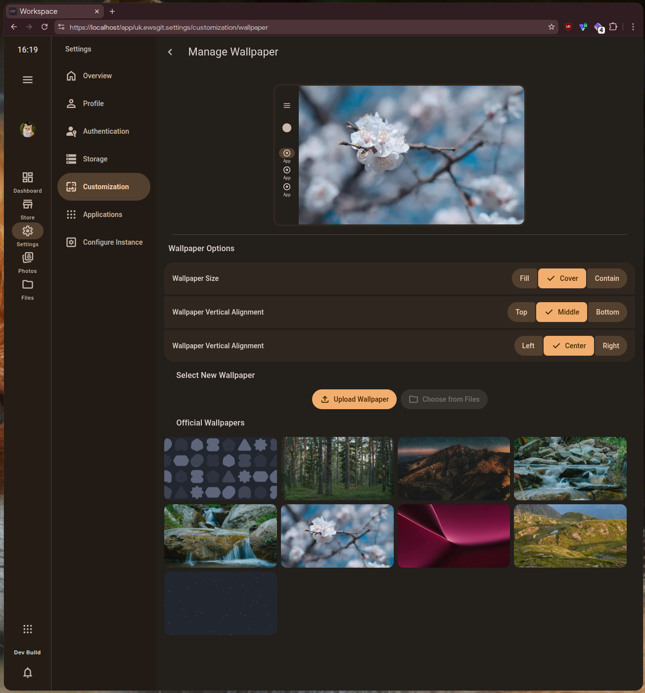

A self-hosted web platform for applications & services with design based on Google's Material 3 Expressive.

---

> [!WARNING]
> Online Workspace is not yet intended for production use. Although early adoption for testing purposes is appreciated.

### Links

- Source Code (GitHub) -> <https://github.com/onlineworkspace/onlineworkspace>
- Installation Guide (NON Production) -> [Installation Guide for Development Environments](#installation-guide-for-development-environments)

## Screenshots








<!--
## Installation Guide for Production Environments (Docker)

---

### Dependencies

| Dependency | External Installation Guide | Optional |
| ---------- | --------------------------- | -------- |
| Docker     | https://www.docker.com/     | No       |

### Installation

1. Ensure all dependencies are installed before continuing
2. Ensure that the installation environment is running a supported version of Linux
3. `cd /`
4. create a directory to house the Workspaces filesystem root e.g.: `sudo mkdir /onlineworkspaces/workspaces`
5. change into the newly created directory `cd /onlineworkspaces/workspaces`
6. clone the workspaces docker configuration from git `git clone git@github.com:onlineworkspace/workspace-docker.git .`
7. edit `docker-compose.yaml` to your desired configuration from [Insert link to relevant documentation here] before continuing.
8. run `docker-compose up` to start the workspaces docker image and install all remaining dependencies
9. open your browser and head to `https://[server-ip]` and follow the on-screen instructions to complete the setup.
-->

<!--
## Installation Guide for Production Environments (Manual)

---

### Dependencies

| Dependency | External Installation Guide      | Optional |
| ---------- | -------------------------------- | -------- |
| Deno (CANARY REQUIRED)      | https://deno.land                | No       |
| PostgreSQL | https://www.postgresql.org/      | No       |

1. Ensure all dependencies are installed before continuing
2. Ensure that the installation environment is running a supported version of Linux
3. `cd /`
4. create a directory to house the Workspaces filesystem root e.g.: `sudo mkdir /var/www/workspaces`
5. change into the newly created directory `cd /var/www/workspaces`
6. clone the workspaces docker configuration from git `git clone git@github.com:onlineworkspace/workspace.git .`
7. run `deno install`
8. create a postgresql database called `onlineworkspace_workspace`
9. change into the `instance` directory
10. copy `meta/backend.service` to `/etc/systemd/system/workspaces-backend.service`.
11. run `systemctl enable workspaces-backend --now` to start the backend
12. change into the project root `/var/www/workspaces`
13. run `deno build-web`
14. choose a webserver of your choice to serve `/var/www/workspaces/web/dist` (caddy is fast & easy to use)
15. open your browser and head to `https://[server-ip]` and login as the user `admin` with password `password` to finish setup.
-->

## Installation Guide for Development Environments

> [!TIP]
> If you are struggling with the following instructions, please ask for help in the project's discord server which can be found in the links section. -->

### Dependencies

| Dependency             | External Installation Guide        | Optional |
|------------------------|------------------------------------|----------|
| Deno (CANARY REQUIRED) | <https://deno.land>                | No       |
| PostgreSQL             | <https://www.postgresql.org/>      | No       |
| Caddy                  | <https://caddyserver.com/download> | No       |

> [!IMPORTANT]
> Please ensure all non-optional dependencies are installed before proceeding.

1. Ensure all non-NPM dependencies are installed
  - Ubuntu Linux
    1. Install PostgreSQL -> `sudo apt install postgresql postgresql-contrib`
    2. Start the PostgreSQL service -> `sudo systemctl enable --now postgresql`
    3. Switch to the postgres user -> `sudo su postgres`
    4. Open PostgreSQL with psql -> `psql`
    5. Create a PostgreSQL database with the following query -> `CREATE DATABASE onlineworkspace_workspace;`
    6. Change the PostgreSQL password with the following query -> `ALTER USER postgres WITH PASSWORD 'postgres';` (Please note: you should set the password to
       anything other than the example shown here, please ensure if you use another password to use an autoinstall configuration with the non-default password
       specified - see [auto-install Configuration](#auto-install-configuration))
    7. Exit psql -> `exit;`
    8. Logout from the postgres user -> `exit`
    9. Install Caddy -> `sudo apt install caddy`
    10. When installing Caddy, a systemd service is automatically setup. If you are only using Caddy for development purposes, you will need to either modify
        the system Caddyfile to contain the contents of `./Caddyfile` in `/etc/caddy/Caddyfile` OR disable the systemd service with
        `sudo systemctl disable caddy && sudo systemctl stop caddy` before manually running Caddy.
  - Windows
    1. Simply install postgreSQL with the setup file downloaded from the postgreSQL website
    2. Open your database viewer of choice (DBeaver Community Edition is recommended)
    3. Create the `onlineworkspace_workspace` table
    4. Download the caddy executable from the caddy website, this can be placed anywhere but in the repo root directory is recommended for ease of use
  - MacOS
    1. Using Orbstack with an Ubuntu container, follow the Ubuntu Linux instructions above
2. Run `deno install` inside the project root directory to install all NPM dependencies
3. Ensure all auto-install configuration is set before proceeding, if you want a vanilla setup this step can be skipped
   (see [auto-install Configuration](#auto-install-configuration) section in the documentation for more details)
4. Run `deno run dev` to start up the web interface and backend in development mode
5. If on Linux or MacOS, ensure that caddy is allowed to bind to ports lower than 1024 by running `sudo setcap 'cap_net_bind_service=+ep' $(which caddy)`.
6. Run Caddy

- Linux & MacOS (Note: if you have chosen to keep the systemd service and have copied the contents of `./Caddyfile` into `/etc/caddy/Caddyfile` then you should
  skip this step and navigate to `https://localhost`)
  - Run `sudo caddy run --config ./Caddyfile` to start the caddy server with the provided configuration (this will serve the web interface on`https://localhost`
    by default)
- Windows Run `.\caddy.exe run --config ./Caddyfile` to start the caddy server with the provided configuration (this will serve the web interface on
  `https://localhost` by default)

## Auto-install Configuration

To automatically configure an onlineworkspace instance on the first run, create a directory called `autoinstall` in the project root and place a `config.json`
file inside with the following structure:

```json
{
  "enabledFeatures": [
    "slash_commands"
  ],
  "databases": {
    "postgres": {
      "user": "postgres",
      "password": "postgres",
      "host": "localhost",
      "port": 5432,
      "database": "onlineworkspace_workspace"
    }
  },
  "backendUrl": "https://localhost",
  "proxyUrl": [
    "https://localhost"
  ],
  "signupRequirements": {
    "email": false,
    "twoFactorAuthentication": false,
    "passwordMinimumLength": 8,
    "passwordContains": {
      "minimumUppercase": 1,
      "minimumLowercase": 1,
      "minimumNumbers": 1,
      "minimumSymbols": 1
    }
  },
  "displayName": "Workspace",
  "mailserver": {
    "host": "smtp.example.com",
    "port": 587,
    "secure": true,
    "auth": {
      "user": "user",
      "pass": "password"
    }
  },
  "termsOfUse": {
    "message": "1. Acceptance of Terms\n    - By logging in, you agree to these rules. If you do not agree, please do not use the service.\n2. Account Security\n    - You are the gatekeeper of your account. Keep your password private, as you are responsible for all activity that happens under your login.\n3. Content Ownership\n    - What is yours remains yours. We claim no ownership over the files, photos, or data you upload to this instance.\n4. Acceptable Use\n    - Do not use this space for anything illegal, malicious, or harmful. This includes uploading malware or attempting to disrupt the service for others.\n5. Privacy and Access\n    - We value your privacy. We will not access your stored data unless it is strictly necessary for technical support or required by legal authorities.\n6. Storage and Maintenance\n    - While we strive for 100% uptime, this service is provided \"as is.\" We may occasionally perform maintenance that results in temporary downtime.\n7. Personal Responsibility\n    - Hardware and software can fail. You agree to maintain your own external backups of any mission-critical data. We are not liable for data loss.\n8. Termination\n    - We reserve the right to suspend or close accounts that violate these terms or compromise the security of the server.\n9. Policy Updates\n    - These terms may change. If we make significant updates, we will post a notification within the app or send an email.",
    "lastUpdated": 1774139372136
  },
  "defaultQuickShortcuts": [
    "uk.ewsgit.dashboard",
    "uk.ewsgit.store",
    "uk.ewsgit.settings",
    "uk.ewsgit.photos",
    "uk.ewsgit.files"
  ]
}
```

Any fields provided in the `config.json` file will override the default settings. By leaving out any fields, the default values will be used instead. This
allows you to only modify the settings you want to change while leaving the rest of the default configuration intact.

Instance branding assets can be added to the `autoinstall` directory and should be located and named as follows:

- `autoinstall/assets/login/banner.png`
