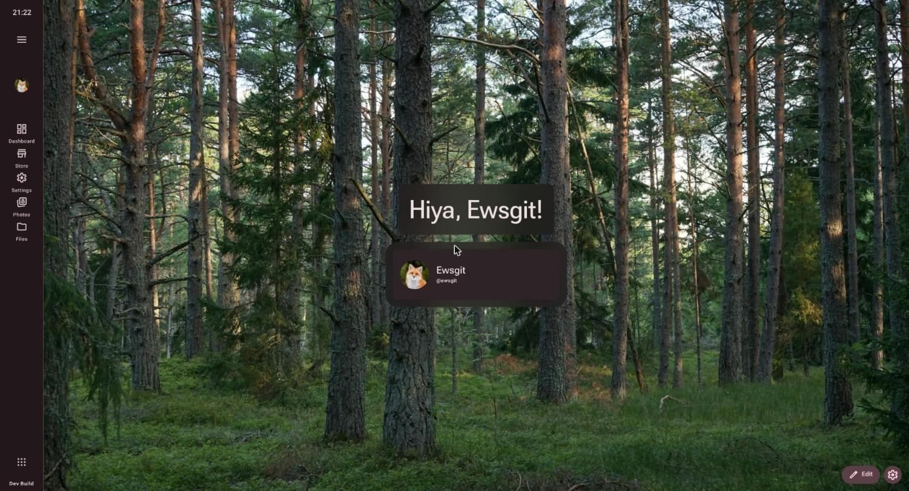
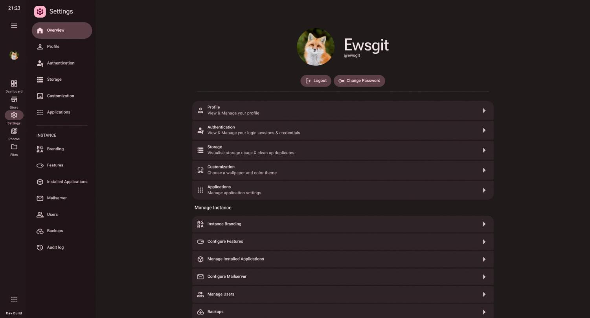

<p align="center">
  
</p>

<p align="center">
  <b>Your own web desktop.</b> Files, photos and apps on a server you control, in a Material 3 Expressive interface.
</p>

<p align="center">
  <a href="#quick-start">Quick start</a> ·
  <a href="#applications">Applications</a> ·
  <a href="#configuration">Configuration</a> ·
  <a href="#running-publicly">Running publicly</a> ·
  <a href="#project-layout">Project layout</a>
</p>

> [!WARNING]
> Online Workspace is in early development and is not ready for production use. Trying it out and reporting what breaks is very welcome.



## What is it?

Online Workspace is a self-hosted platform that gives you, and the people you share your server with, a browser-based workspace. Each user gets a
personal desktop with a wallpaper, a colour theme, a quick-launch bar and a set of installable applications. Everything is stored on your own hardware, in a
PostgreSQL database and a plain directory tree.

- **Self-hosted.** Your files, photos and account data stay on your server.
- **Multi-user.** Per-user home folders, storage quotas and an administrator role.
- **Application based.** Every feature is an application with its own manifest, web frontend and backend module. Install or remove them from the Store.
- **Secure by default.** Password, passkey and authenticator-app sign-in, enforced two-factor for administrators, rate limiting and an audit trail.
- **Yours to style.** Pick a colour theme and wallpaper per user, and brand the instance with your own name, login banner and terms of use.

## Screenshots



## Applications

Applications live in [`applications/`](./applications). Each one is described by a `manifest.json`.

| Application | ID | What it does |
| ----------- | -- | ------------ |
| Dashboard | `uk.ewsgit.dashboard` | The home page: a greeting and your profile over your wallpaper. |
| Files | `uk.ewsgit.files` | Browse, search, filter and manage your files, with places, recent, starred and trash. |
| Photos | `uk.ewsgit.photos` | View and organise photos and videos, with albums, memories, sharing and trash. |
| Store | `uk.ewsgit.store` | Discover, search and manage installed applications. |
| Settings | `uk.ewsgit.settings` | Profile, authentication, storage, customization and, for administrators, instance management. |
| Console | `uk.ewsgit.console` | The administrator console as an application. |
| Guide | `uk.ewsgit.guide` | A short tour of your Workspace and its applications. |
| Ghostty | `uk.ewsgit.ghostty` | The Ghostty terminal. Mostly a placeholder for now. |
| Process Orchestrator | `uk.ewsgit.processorchestrator` | Administrators only. Run and supervise server processes from an executable or a git repository, with a live terminal, stdin and crash notifications. |

### Administration

Administrators manage the instance from **Settings**:

- **Branding, features and mail server.** Name the instance, toggle feature flags and configure SMTP for email codes and password resets.
- **Users.** Create and manage accounts, and set quotas.
- **Installed applications.** Choose which applications are available.
- **Backups.** Back up the database, the configuration and every user's files, on demand or on a schedule with a retention count. Incremental backups copy only
  the files which changed since the previous backup (the database is always dumped whole) and are restored together with the backups they continue from.
- **Audit log.** A searchable record of sign-ins, password and two-factor changes, user management, instance changes and backups.

The server also has a built-in console with commands such as `users`, `mkuser`, `op`, `apps` and `features`. Enable the `slash_commands` feature to use
them.

## Quick start

These steps set up a **development** environment.

### Requirements

| Dependency | Install guide                      |
| ---------- | ---------------------------------- |
| Bun        | <https://bun.sh>                   |
| PostgreSQL | <https://www.postgresql.org/>      |
| Caddy      | <https://caddyserver.com/download> |

### 1. Get the code

```bash
git clone git@github.com:onlineworkspace/onlineworkspace --recurse-submodules
cd onlineworkspace
bun install
```

### 2. Prepare PostgreSQL

On Ubuntu:

```bash
sudo apt install postgresql postgresql-contrib
sudo systemctl enable --now postgresql
sudo -u postgres psql -c "CREATE DATABASE onlineworkspace;"
sudo -u postgres psql -c "ALTER USER postgres WITH PASSWORD 'postgres';"
```

Use a different password if you can, and tell the instance about it with an [auto-install configuration](#auto-install-configuration). On Windows, install
PostgreSQL from its website and create an `onlineworkspace` database with your database tool of choice. On macOS, run an Ubuntu container (for example with
OrbStack) and follow the Ubuntu steps.

### 3. Start the backend and web interface

```bash
bun run dev
```

### 4. Start Caddy

Caddy serves the app on `https://localhost` using the repository's [`Caddyfile`](./Caddyfile). Allow it to bind to ports below 1024 on Linux and macOS first:

```bash
sudo setcap 'cap_net_bind_service=+ep' $(which caddy)
```

```bash
sudo caddy run --config ./Caddyfile
```

On Windows, run `.\caddy.exe run --config ./Caddyfile`.

> [!NOTE]
> If installing Caddy created a systemd service, either disable it (`sudo systemctl disable --now caddy`) or copy the contents of `./Caddyfile` into
> `/etc/caddy/Caddyfile` and use that instead.

### 5. Finish setup

Open <https://localhost>. A fresh instance starts in setup mode and walks you through the database, address, administrator account, branding, mail, applications, new-user defaults and terms of use.

### Scripts

| Command | Description |
| ------- | ----------- |
| `bun run dev` | Start the backend (and web frontend) in development mode with file watching. |
| `bun run start` | Start the backend once, without watching. |
| `bun run dev-debug` | Start the backend with the inspector attached and waiting. |
| `bun run build-web` | Build the web frontend into `web/dist`. |
| `bun run uikit` | Run the UI kit playground (`uikit-solid`). |

## Configuration

Instance settings are stored in `fs/configuration.json` and most of them can be changed from **Settings** once you are signed in as an administrator.

### Auto-install configuration

To pre-configure an instance on its first run, create `autoinstall/config.json` in the project root. Any field you leave out keeps its default.

```json
{
  "isDevMode": true,
  "databases": {
    "postgres": {
      "user": "postgres",
      "password": "postgres",
      "host": "localhost",
      "port": 5432,
      "database": "onlineworkspace"
    }
  },
  "proxy": { "secure": true, "hostname": "localhost" },
  "enabledFeatures": ["slash_commands"],
  "signupRequirements": {
    "email": false,
    "twoFactorAuthentication": false,
    "passwordMinimumLength": 5,
    "passwordContains": {
      "minimumLowercase": 1,
      "minimumNumbers": 1,
      "minimumSymbols": 1,
      "minimumUppercase": 1
    }
  },
  "displayName": "Workspace",
  "mailServer": {
    "host": "smtp.example.com",
    "port": 587,
    "secure": true,
    "auth": { "user": "user", "pass": "password" }
  },
  "defaultQuickShortcuts": ["uk.ewsgit.dashboard", "uk.ewsgit.store", "uk.ewsgit.settings", "uk.ewsgit.photos", "uk.ewsgit.files"],
  "defaultApplications": [
    { "id": "uk.ewsgit.dashboard", "uri": "local:uk.ewsgit.dashboard" },
    { "id": "uk.ewsgit.store", "uri": "local:uk.ewsgit.store" },
    { "id": "uk.ewsgit.settings", "uri": "local:uk.ewsgit.settings" },
    { "id": "uk.ewsgit.photos", "uri": "local:uk.ewsgit.photos" },
    { "id": "uk.ewsgit.files", "uri": "local:uk.ewsgit.files" }
  ],
  "userDefault": {
    "homeDirectories": ["Documents", "Photos", "Videos", "Projects"],
    "quotaSize": 10485760,
    "displayNameFormat": "New User %num%"
  },
  "termsOfUse": { "message": "Your terms of use, one rule per line.", "lastUpdated": 1782388315951 },
  "caddyfile": "../Caddyfile",
  "apiPort": 3563
}
```

Branding assets go in the same directory. The login banner is read from `autoinstall/assets/login/banner.png`.

### Feature flags

| Flag | Purpose |
| ---- | ------- |
| `slash_commands` | Enable the server console commands. |
| `allow_user_signups` | Let visitors create their own accounts. |
| `display_profiles_at_logon` | Show the available profiles on the sign-in screen. |
| `clear_terminal_console_on_startup` | Clear the server terminal when the backend starts. |
| `experimental_terminal_gui` | Experimental terminal interface for the server. |
| `shoot_yourself_in_the_foot` | Unlocks unsafe operations. Leave this off. |

## Running publicly

Online Workspace is not production ready, but if you expose an instance, follow these points.

- **Use the generated Caddy configuration** (`fs/system/Caddyfile`). It sets the security headers and the client address (`X-Real-IP`) that rate limiting
  relies on. The backend port (`apiPort`) must be reachable only through Caddy, never directly from the internet.
- **Turn off development mode.** Set `"isDevMode": false` in `configuration.json`. In development mode the frontend is served by the Vite dev server and no
  content security policy is applied.
- **Rate limits** cover sign-in, sign-up, password resets, email codes and the setup token, per client address. Requests that change something must come
  from the instance's own pages.
- **Administrators need two-factor authentication** (an authenticator app or a passkey) before they can use the instance.
- **Quotas** are enforced for uploads and copies in Files, Photos and Settings. A quota of `0` means unlimited.
- **Backups** need `pg_dump`, `pg_restore` and `tar` on the server's `PATH`. They are written to `fs/backups` and contain the database and configuration, so keep
  that folder private.
- **Health checks.** `GET /api/health` returns `200` with `{"status":"ok"}` while the instance is running and its database is reachable, and `503` otherwise.
  Point your uptime monitor at it.
- **Audit log retention** is controlled by `auditLogRetentionDays` (365 by default, `0` keeps entries forever).

## Project layout

```
.
├── applications/   Built-in applications (manifest, web frontend, backend module)
├── backend/        Bun + tRPC server: authentication, users, filesystem, backups, audit
├── web/            SolidJS web shell: setup wizard, sign-in, desktop and navigation
├── uikit-solid/    Shared Material 3 Expressive component library (git submodule)
├── fs/             Runtime data: configuration, users' files, backups, assets
└── Caddyfile       Reverse proxy for local development
```

**Built with** [Bun](https://bun.sh), [TypeScript](https://www.typescriptlang.org/), [SolidJS](https://www.solidjs.com/), [Vite](https://vite.dev),
[tRPC](https://trpc.io), [PostgreSQL](https://www.postgresql.org/) and [Caddy](https://caddyserver.com).

## Contributing

Issues and pull requests are welcome at <https://github.com/onlineworkspace/onlineworkspace>. Code is formatted with [Biome](https://biomejs.dev).

## License

Released under the MIT License. See [LICENSE.md](./LICENSE.md).
